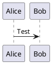

### How an Angular App Gets Loaded and Started

- **Code Structure**: 
  - It's essential to understand Angular's code structure.
- **Initial File**: 
  - The server primarily serves the `index.html` file, with its main root HTML element being `<app-root></app-root>`.
- **Key Component**: 
  - The core mechanism is encapsulated in `app.component.ts`.

```typescript
@Component({
  selector: 'app-root',
  templateUrl: './app.component.html',
  styleUrls: ['./app.component.css']
})
```

- **Selector Role**: 
  - The `selector` identifies the `'app-root'` HTML tag and replaces it with content from `./app.component.html`.
- **Execution Entry Point**: 
  - The application's starting point is `main.ts`.


## Why are Components Important?

- **Modularity**: 
  - _Breaks UI_ into small, easy-to-manage chunks.
  
- **Reusability**: 
  - Use components multiple times, avoiding redundant work.

- **Isolation**: 
  - Each component stands alone, minimizing bugs from overlaps.

- **Encapsulation**: 
  - Keeps internal details hidden, ensuring safer usage.

- **Testability**: 
  - Test one component without involving the whole app.

- **Consistency**: 
  - Components make sure every part of your app looks and feels the same to the user.

- **Efficiency**: 
  - Enables advanced features like _lazy loading_.

In essence, components make Angular apps more organized, consistent, and efficient.


## Creating a New Component

### Folder Structure:
- Create a new folder inside the `app` directory.
- Ensure the folder's name matches the component's name.
  - For this example, the folder's name is `server`.

### Component Basics:
- A component is essentially a TypeScript class.
  - The file is named `server.component.ts`.
  - The component's name is `ServerComponent`.
- Components require the `@Component` decorator, which should be imported from `'@angular/core'`.

### Standard Component Structure:
Components typically consist of the following files:
   - `.ts`: Contains the component's logic.
   - `.html`: Defines the component's visual layout or template.
   - `.css`: Holds the component's styles.
   - `.spec.ts`: Used for writing tests for the component.

### Example of `server.component.ts`:
```typescript
import { Component } from "@angular/core";

@Component({
    selector: 'app-server',
    templateUrl: './server.component.html'
})
export class ServerComponent {

}
```


## Explanation of `selector` and `templateUrl`

### 1. `selector`
- **What is it?** 
  - A custom HTML tag for the component.
- **Usage**: 
  - Whenever you add `<app-server></app-server>` in an HTML template, Angular will render the `ServerComponent` in its place.

### 2. `templateUrl`
- **What is it?** 
  - A path to the component's visual layout (an HTML file).
- **Purpose**: 
  - Defines the visual appearance of the `ServerComponent`, as specified in `server.component.html`.


## Angular Modules: A Simple Overview

Angular modules act as containers for different sections of your application.

1. **Definition**: 
   - A module groups together components, services, and other Angular essentials.

2. **Root Module**: 
   - Every Angular app starts with a primary module, typically named `AppModule`.

3. **Feature Modules**: 
   - Separate modules can be created for specific functionalities or user features.

4. **Imports/Exports**: 
   - Modules can borrow features from other modules (`imports`) and share their features with them (`exports`).

5. **Lazy Loading**: 
   - Certain modules can be set to load only when they're needed, improving initial app speed.

6. **Providers**: 
   - These offer services that can be used across the app.

In short, modules in Angular help maintain order and organization by bundling related functionalities together.


## Appmodule and Component Declaration
### Overview
`app.module.ts` serves as the primary configuration file for an Angular application.

### Importance
- **Central Registration**: It's like the table of contents for your Angular app.
- **Recognition**: By registering your component here, you inform Angular about its existence.

### Consequences
- If a component isn't listed in `app.module.ts`:
  - Angular remains unaware of it.
  - The component can't be utilized in your templates.

### Conclusion
For Angular to recognize and use your component, it must be registered in the `app.module.ts` file.


## Modifications in `app.modules.ts`

For our example, we've included the following in `app.modules.ts`:

```typescript
...
import { ServerComponent } from './server/server.component';

@NgModule({
  declarations: [
   ...
    ServerComponent,
  ],
...
```

## Utilizing Custom Components

- The file of interest: `app.component.html`
- `app-server` acts as the selector for our custom component:

```html
<h3>I am in the AppComponent</h3>
<hr>
<app-server></app-server>
```

## Component Generation using the CLI

- Use the following commands to generate components:
  - `ng generate component <name>`
  - Short form: `ng g c <name>`

## Working with Component Templates

- Instead of separate HTML files, inline templates can be employed.
  - Switch `templateUrl` to `template` in the `component.ts` file.
  
Single line inline template:

```typescript
@Component({
  selector: 'app-servers',
  template: "<app-server></app-server>",
  styleUrls: ['./servers.component.css']
})
```

For multi-line HTML:

```typescript
@Component({
  selector: 'app-servers',
  template: `
  <app-server></app-server>
  <app-server></app-server>
  `,
  styleUrls: ['./servers.component.css']
})
```

## Handling Component Styles

- A reminder: We're utilizing Bootstrap in this project.
- For custom styling tweaks, modify the respective CSS files.
- Multiple stylesheets can be referenced since `styleUrls` is an array, e.g., `styleUrls: ['./servers.component.css', './test.css']`.
  
Using inline styles:

```typescript
@Component({
  selector: 'app-servers',
  templateUrl: './servers.component.html',
  styles: [`h3 { color: blue; }`]
})
```


